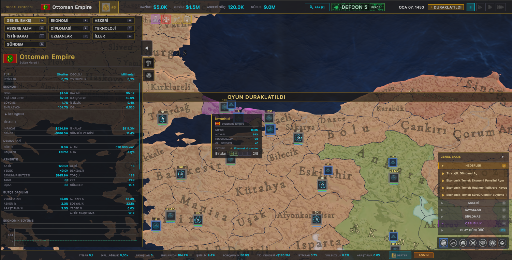

# Global Protocol: Old World Order

[](https://github.com/Dorlion-Interactive/Global-Protocol-Old-World-Order-Mod/releases)
[](https://github.com/Dorlion-Interactive/Global-Protocol-Old-World-Order-Mod/releases)
[](LICENSE)


A historical total conversion mod for **[Global Protocol: New World Order](https://globalprotocolgame.com)** — play the world as it was in **1450 AD**.

~120 playable nations · Ottoman Empire · Ming Dynasty · Aztec Empire · Kingdom of France · and more.

## WIP Screenshot Example

WIP: in-game visuals and UI are still being refined and may change before release.



---

## For Players

If you just want to play the mod:

1. Download the latest version from the **[Releases](https://github.com/Dorlion-Interactive/Global-Protocol-Old-World-Order-Mod/releases)** page.
   *(Note: Look for the `old-world-order-latest.zip` asset in the latest release)*
2. Extract it into:
   ```
   %LOCALAPPDATA%\NewWorldOrder\Mods\globalprotocol.old_world_order\
   ```
3. Start Global Protocol, open **Mods**, enable **Old World Order**, then launch the 1450 scenario.

No build step is needed.

---

## For Developers

If you want to clone this repo and build your own version of the mod:

1. Clone the repository.
2. Open the project in VS Code.
3. Run `install.bat` to build and install the default native C# SDK variant.
4. Recommended WASM runtime path: AssemblyScript (`install.bat /as`).
5. Experimental .NET WASM variant (`OldWorldOrder.ModWasmNet` + `GlobalProtocol.ModWasmSdk`): `install.bat /dotnet`.
6. Make your changes, then run the installer again to rebuild and redeploy.

Internal default policy for this repo:
- `install.bat` (no flags) stays SDK-first (`/sdk`) for stable local deploys and CI release packaging.
- AssemblyScript (`/as`) is the recommended WASM runtime path when you want a WASM build.

For build details and reference material, see the **[Wiki](https://github.com/Dorlion-Interactive/Global-Protocol-Old-World-Order-Mod/wiki)**.

## Modder Quick Start

Use this repo as a working template when building your own Global Protocol mod.

### Quick Start: 3 Runtime Options

1. **Native C# SDK hooks (default internal build/publish path)**
   - Command: `install.bat` (or `install.bat /sdk`)
   - Project: `Content/mod-csharp/OldWorldOrder.ModCSharp.csproj`
2. **.NET WASM + WASM SDK**
   - Command: `install.bat /dotnet`
   - Mod entry project: `Content/wasm-dotnet/OldWorldOrder.ModWasmNet.csproj`
   - SDK project: `Content/wasm-dotnet/GlobalProtocol.ModWasmSdk/GlobalProtocol.ModWasmSdk.csproj`
3. **AssemblyScript core WASM (recommended WASM runtime path)**
   - Command: `install.bat /as`
   - Source: `Content/wasm-as/mod.ts`

### Runtime Comparison

| Option | Language | Stability | Complexity | Pros | Cons | Performance Notes |
|---|---|---|---|---|---|---|
| .NET WASM + `GlobalProtocol.ModWasmSdk` | C# (.NET 10 WASI) | Medium-High | Medium | Familiar C#, clean hook override model, sandboxed WASM deployment, easy sharing of SDK helpers | Requires WASI toolchain + component runtime path, larger artifact than AS | Usually slower than native C# for heavy per-tick workloads, but fast enough for most hook-driven gameplay logic |
| Native C# SDK (`GlobalProtocol.ModSdk`) | C# (.NET Standard) | High | Low-Medium | Best debugging ergonomics, strongest runtime maturity, direct SDK workflow | Not sandboxed, managed DLL deploy path only | Best raw CPU throughput in this repo for heavy logic loops |
| AssemblyScript core WASM | TypeScript/AssemblyScript | Medium | Medium-High | Small binary, broad core-WASM compatibility, no .NET workload required | Weaker type/runtime ergonomics than C#, fewer shared SDK abstractions | Usually good startup/load size characteristics; runtime speed depends heavily on generated WASM patterns |

### Localization Notes

1. Localize mod UI text using:
   - `overrides/localization_en.csv`
   - `overrides/localization_tr.csv`
2. For the startup briefing flow, provide:
   - `mod.owo.popup.startup.title`
   - `mod.owo.popup.startup.body_with_date`
   - `mod.owo.popup.startup.body_no_date`

For full engine-facing scripting details, see `docs/modding/WASM_SCRIPTING_GUIDE.md` in this repo.

*Visit the official site: [globalprotocolgame.com](https://globalprotocolgame.com)*
