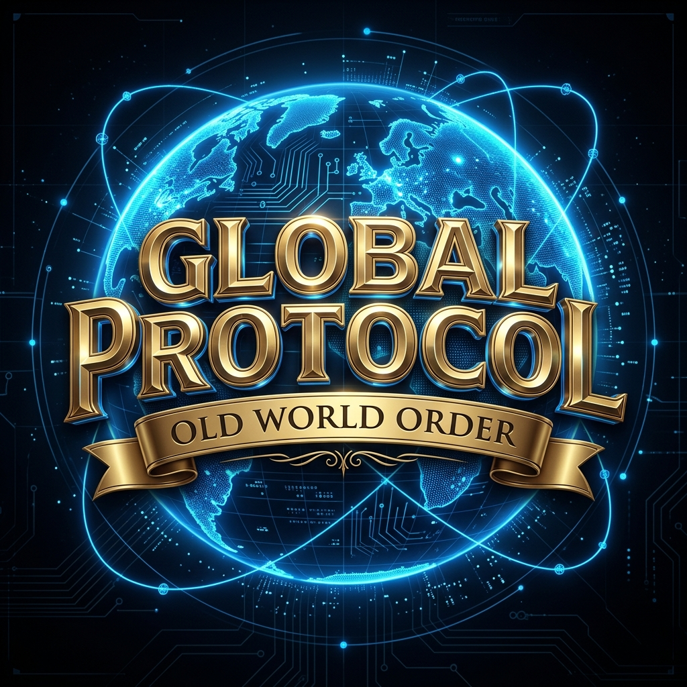

# Global Protocol: Old World Order

[](https://github.com/Dorlion-Interactive/Global-Protocol-Old-World-Order-Mod/releases/latest/download/old-world-order-latest.zip)
[](https://github.com/Dorlion-Interactive/Global-Protocol-Old-World-Order-Mod/releases)
[](LICENSE)



This is an official historical total conversion mod for **[Global Protocol: New World Order](https://globalprotocolgame.com)**.

---

## Download & Install (players)

1. **[Download old-world-order-latest.zip](https://github.com/Dorlion-Interactive/Global-Protocol-Old-World-Order-Mod/releases/latest/download/old-world-order-latest.zip)** — always the latest version
2. Extract it into:
   ```
   %LOCALAPPDATA%\NewWorldOrder\Mods\globalprotocol.old_world_order\
   ```
3. Launch Global Protocol → open the **Mods** screen → enable **Old World Order** → start the 1450 scenario

No prerequisites. No build step.

---

## Developer Quick Start (from source)

```bat
git clone https://github.com/Dorlion-Interactive/Global-Protocol-Old-World-Order-Mod
cd old-world-order
install.bat
```

Then launch Global Protocol, open the **Mods** screen, enable **Old World Order**, and start the 1450 scenario.

> `install.bat` auto-detects Node.js and builds the WASM module before installing. Use `/dotnet` to build with .NET WASI instead. Use `/skip-build` to re-install an already-built mod.

### Scripting Quick Start

Three scripting approaches are available — pick one:

| Variant | Language | File to edit | How to build |
|---|---|---|---|
| **A — .NET WASI** | C# → WASM | [Content/wasm-dotnet/Hooks.cs](Content/wasm-dotnet/Hooks.cs) | `install.bat /dotnet` |
| **B — AssemblyScript** | TypeScript-like → WASM | [Content/wasm-as/mod.ts](Content/wasm-as/mod.ts) | `install.bat` *(default)* |
| **C — Native C#** | C# (no WASM) | [Content/mod-csharp/ModEntrypoint.cs](Content/mod-csharp/ModEntrypoint.cs) | `dotnet build -c Release` |

**Recommended starting point:** Variant C — open [OldWorldOrder.sln](OldWorldOrder.sln) in Visual Studio or Rider, go to [Content/mod-csharp/ModEntrypoint.cs](Content/mod-csharp/ModEntrypoint.cs), and override the hooks you need. Full IntelliSense, no WASM toolchain required.

All three files have the same structure: every available hook is listed with a comment explaining its parameters. Delete the ones you don't need, write your logic in the ones you keep.

The [sdk/](sdk/) project provides compile-time stubs (`ModHookBus`, `ModBase`, `IModEntrypoint`) for IntelliSense — do not ship that DLL with your mod.

---

## 🌍 At a Glance
**Old World Order** transports the high-stakes geopolitical simulation of Global Protocol back to the year **1450 AD**. Experience the late medieval world on the cusp of the Renaissance and the Age of Discovery.

*   **Era**: 1450 AD (Late Medieval / Early Modern transition)
*   **Scope**: ~120 playable nations, including the Ottoman Empire, Ming Dynasty, Kingdom of France, and the Aztec Empire.
*   **Historical Accuracy**: Custom-tailored unit types (Janissaries, Longbowmen, Samurai), historical ruler names, and era-appropriate economic scaling (Florins).
*   **Custom Content**: 100% replacement of vanilla modern-day assets with historical equivalents, including unique flags and national goals.

---

## 🛠️ Modding Showcase & Documentation
This project serves as the primary **showcase for the modding capabilities** of the Global Protocol engine. It demonstrates JSON-based scenario building, asset overrides, and live WASM scripting.

### What's Demonstrated Here:
*   **Scenario Definition**: How to build a comprehensive world state from scratch using split scenario files.
*   **Asset Overrides**: Customizing military markers, flags, and UI elements.
*   **National Goals**: Implementing era-specific objectives and rewards.
*   **WASM Scripting (live)**: Three runtime variants showing the same feature — a welcome popup triggered from WASM hooks:
    *   **Variant A** — `.NET WASI` → component-model WASM (`Content/wasm-dotnet/`) — build with `install.bat /dotnet`
    *   **Variant B** — `AssemblyScript` → core WASM (~15 KB, no extra tooling) (`Content/wasm-as/`) — build with `install.bat` *(default)*
    *   **Variant C** — Native C# delegate, no WASM (`Content/mod-csharp/`) — set `"runtimePolicy": "csharp_only"` in `mod.json` to test

### Building the WASM Module

**Requires:** Node.js ≥ 18 (for AssemblyScript, the default)

```bat
install.bat          :: builds AssemblyScript variant and installs
install.bat /dotnet  :: builds .NET WASI variant (requires .NET 10 SDK + wasi-experimental workload)
```

For the full build + test guide, see [docs/modding/WASM_SCRIPTING_GUIDE.md §10](docs/modding/WASM_SCRIPTING_GUIDE.md).

### Docs & Schemas
*   [Modding Reference](docs/modding/MODDING_REFERENCE.md) — all fields, enums, and scenario format
*   [WASM Scripting Guide](docs/modding/WASM_SCRIPTING_GUIDE.md) — hook exports, host imports, build & test
*   [UI Injection Guide](docs/modding/UI_INJECTION_GUIDE.md) — toolbar buttons, panels, province/country rows
*   [JSON Schemas](docs/modding/schemas/) — machine-readable schemas for all scenario files

---

*Visit the official site: [globalprotocolgame.com](https://globalprotocolgame.com)*
