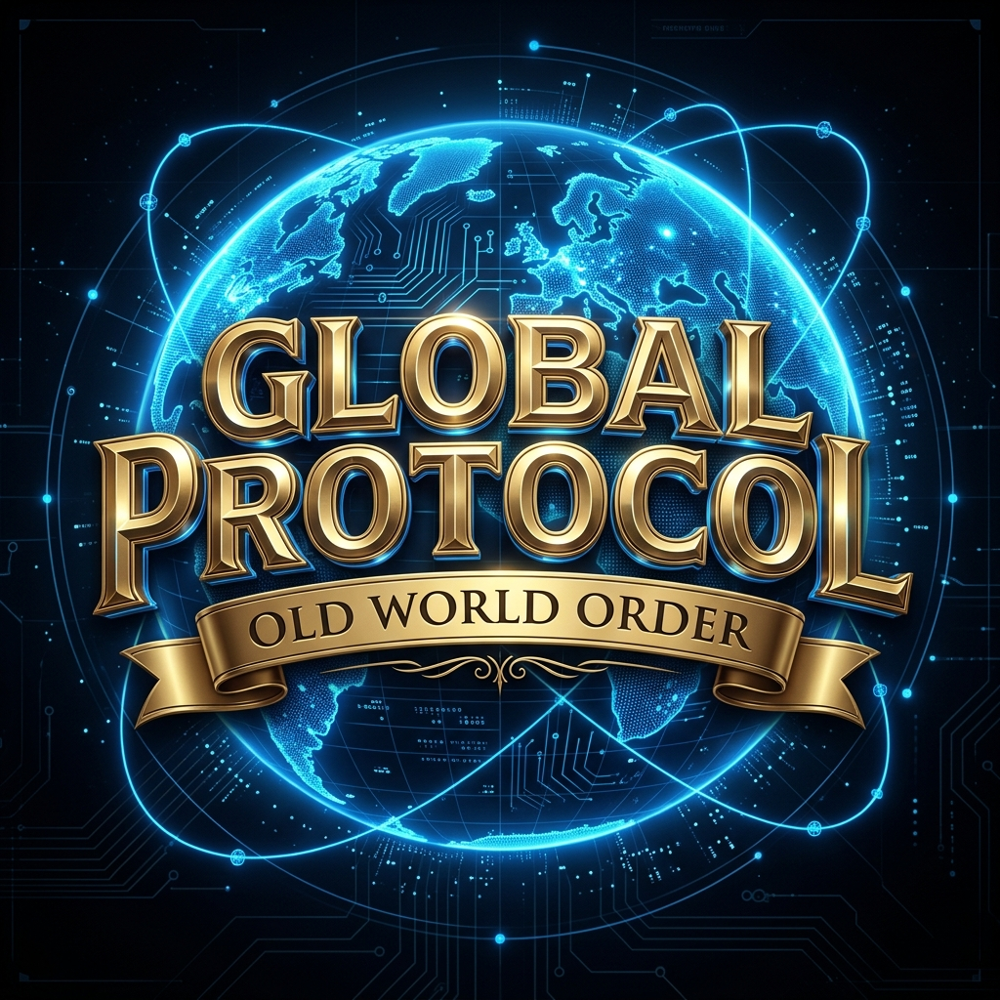
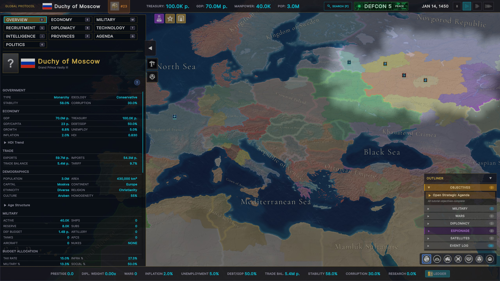
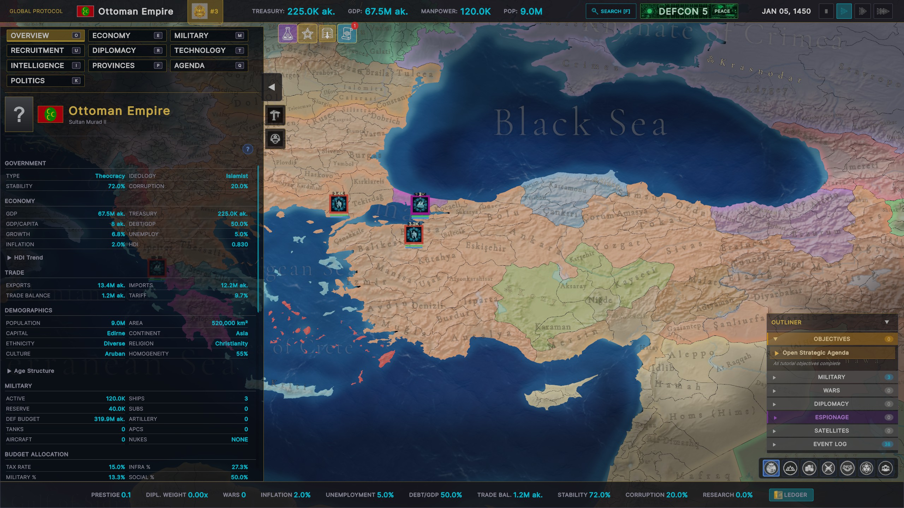
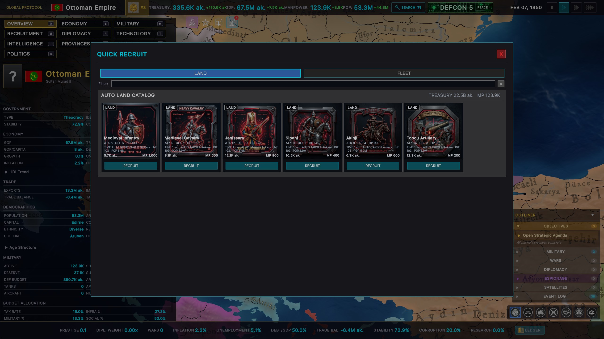
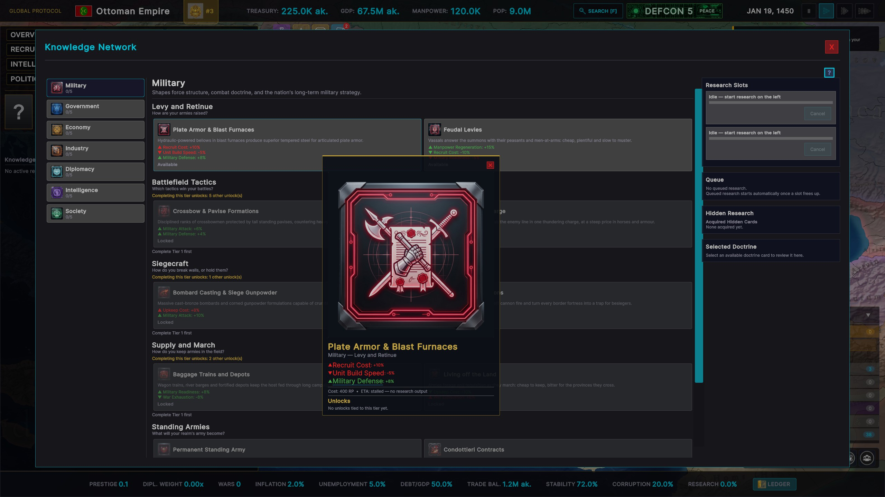
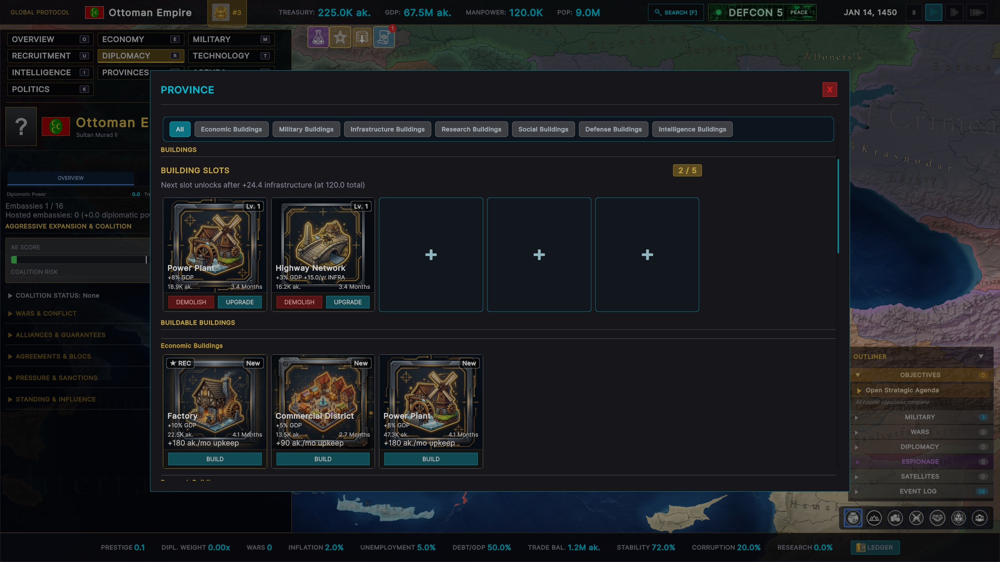

# Global Protocol: Old World Order

[](https://github.com/Dorlion-Interactive/Global-Protocol-Old-World-Order-Mod/releases)
[](https://github.com/Dorlion-Interactive/Global-Protocol-Old-World-Order-Mod/releases)
[](LICENSE)



A historical total conversion mod for **[Global Protocol: New World Order](https://globalprotocolgame.com)** — play the world as it was in **1450 AD**.

> **Requires Global Protocol v0.5.10 or later.**

137 playable nations · Ottoman Empire · Ming Dynasty · Aztec Empire · Kingdom of France · and more.



## Screenshots

| | |
|---|---|
|  |  |
| The Ottoman Empire under Sultan Murad II | Janissaries, Sipahi, Akinji and Topçu artillery |
|  |  |
| A 1450 doctrine tree replaces the modern one | Medieval building art |

---

## What's in the Mod

- **The world of 1450.** 137 nations drawn on historical footprints, from Castile and Muscovy to the Mali Empire, Vijayanagara and the Inca. All 266 modern countries are removed.
- **Medieval armies and fleets.** 42 starting armies and 20 fleets built from 33 period units (8 shared + 25 unique), including knights, men-at-arms, crossbowmen, bombards, longbowmen, war elephants, galleys, cogs and carracks. 25 of them are unique to one nation, such as the Janissary, the Swiss pike square, the samurai or the Ming treasure ship. Each nation recruits from its own roster, so landlocked powers build no ships. Modern units and the air, missile and special categories are switched off.
- **A new Knowledge Network.** Seven doctrine branches are replaced wholesale with 1450 doctrines (Military, Economy, Government, Society, Diplomacy, Intelligence, Industry). Cyber, Space and Energy are disabled.
- **A pre-industrial economy.** 15 medieval buildings replace the modern roster. 19 modern resources are disabled. Money is counted in florins, with 12 period currencies such as the akçe, liang, pound sterling and livre tournois.
- **National goals.** Scenario goals for the Ottomans, France, Castile, England, Portugal and the Ming, plus starter goals for everyone.
- **Historical events.** Seven events covering the Fall of Constantinople, the end of the Hundred Years' War, the Wars of the Roses, Gutenberg's press and the Portuguese African voyages.
- **Strategic briefing.** A start-of-game briefing popup. HUD toolbar buttons reopen it and open a Historian's Archive.

---

## For Players

**Steam Workshop (easiest):** subscribe to **[Old World Order on the Steam Workshop](https://steamcommunity.com/sharedfiles/filedetails/?id=3724318324)**. Then start Global Protocol, open **Mods**, enable **Old World Order**, and launch the 1450 scenario.

**Manual install:**

1. Download `old-world-order-latest.zip` from the latest **[release](https://github.com/Dorlion-Interactive/Global-Protocol-Old-World-Order-Mod/releases)**.
2. Extract it into:
   ```
   %USERPROFILE%\AppData\LocalLow\Dorlion Interactive\Global Protocol\Mods\globalprotocol.old_world_order\
   ```
3. Start Global Protocol, open **Mods**, enable **Old World Order**, then launch the 1450 scenario.

No build step is needed.

**Languages:** English and Turkish are fully translated. Rows added from 2026-09-28 (homeland terms, leader titles, buildings, historical events) are translated across all 13 supported languages; older mod strings in the remaining 11 locales currently show English text.

---

## For Developers

Everything below works from a plain clone of this repository.

1. Clone the repository and open it in VS Code.
2. Run `install.bat` and pick **[1] local** to build, validate and deploy into your game's mod folder. Pick **[2] Workshop** to stage `workshop_content/` for upload.
3. Make your changes, then run `install.bat` again to rebuild and redeploy.

### `install.bat` flags

| Flag | Effect |
|---|---|
| `/local` | Deploy to `%USERPROFILE%\AppData\LocalLow\Dorlion Interactive\Global Protocol\Mods\globalprotocol.old_world_order` (skips the prompt) |
| `/workshop` | Stage into `workshop_content/` for `publish_workshop.bat` (skips the prompt) |
| `/sdk` (default) | Build the native C# SDK entrypoint → `Mods/OldWorldOrder.ModCSharp.dll`. Needs the .NET SDK. |
| `/as` | Build the AssemblyScript core WASM → `Content/mod.wasm`. Needs Node.js. |
| `/dotnet` | Build the experimental .NET WASI component → `Content/mod.wasm`. Needs .NET 10, the `wasi-experimental` workload and wasi-sdk. |
| `/skip-build` | Redeploy data and art without compiling |

Every deploy except `/skip-build` first runs `dev/validate_scenario.ps1`. It checks that each `scenario/*.json` fragment is an object with the expected top-level key, and it aborts the deploy on a malformed file.

`publish_workshop.bat` uploads `workshop_content/` with SteamCMD to the Workshop item in `mod.json` (`workshopItemId`). You need Steam rights on that item to publish to it.

### Tools

Run these from the repository root.

| Tool | What it does | Needs |
|---|---|---|
| `dev/curate_browse.py` | Browse provinces by modern country, name, bounding box or radius (`python dev/curate_browse.py iso FRA`) | Python 3 |
| `dev/audit_ownership.py` | Per-nation owned area vs declared area, continent spread, unowned count | Python 3 |
| `dev/build_province_ownership.py` | Expands `dev/province_curation.json` into `scenario/provinces_ownership.json` | Python 3 |
| `scripts/audit_inventory.py` | Lists buildings, units, doctrines and resources that have no icon | Python 3 |
| `scripts/process_image.py` | Cleans an art file's white border and saves it as `icons/<category>/<id>.png` and `Content/icons/<category>/<id>.png` | Python 3, `opencv-python`, `numpy` |

The province tools read `dev/province_registry.json`, a slim copy of the game's province registry: id, name, modern country, area and centroid. [`docs/modding/PROVINCE_REFERENCE.md`](docs/modding/PROVINCE_REFERENCE.md) lists every province id.

---

## Modder Quick Start

Use this repo as a working template for your own Global Protocol mod. The engine reference is in **[docs/modding/](docs/modding/README.md)**:

- [Modding Reference](docs/modding/MODDING_REFERENCE.md): every file and field
- [JSON schemas](docs/modding/schemas/README.md)
- [WASM Scripting Guide](docs/modding/WASM_SCRIPTING_GUIDE.md) and [UI Injection Guide](docs/modding/UI_INJECTION_GUIDE.md)
- [Project Atlantis](docs/modding/examples/atlantis/README.md): an event-chain example mod

`docs/modding/` is published from the game and refreshed with each game update. Don't edit it here.

### Runtime Options

1. **Native C# SDK hooks (default build and release path)**
   - Command: `install.bat` (or `install.bat /sdk`)
   - Project: `Content/mod-csharp/OldWorldOrder.ModCSharp.csproj`
2. **AssemblyScript core WASM (recommended WASM path)**
   - Command: `install.bat /as`
   - Source: `Content/wasm-as/mod.ts`
3. **.NET WASM + WASM SDK (experimental)**
   - Command: `install.bat /dotnet`
   - Mod entry project: `Content/wasm-dotnet/OldWorldOrder.ModWasmNet.csproj`
   - SDK project: `Content/wasm-dotnet/GlobalProtocol.ModWasmSdk/GlobalProtocol.ModWasmSdk.csproj`

The installer rewrites the deployed `mod.json` to match the variant: `runtimePolicy` becomes `csharp_only` for `/sdk` and `wasm_only` for the WASM builds.

| Option | Language | Stability | Complexity | Pros | Cons |
|---|---|---|---|---|---|
| Native C# SDK (`GlobalProtocol.ModSdk`) | C# (`netstandard2.0` class library) | High | Low-Medium | Best debugging ergonomics, most mature runtime path | Not sandboxed; managed DLL deploy only |
| AssemblyScript core WASM | TypeScript/AssemblyScript | Medium | Medium-High | Small binary, no .NET workload required | Weaker type/runtime ergonomics than C# |
| .NET WASM + `GlobalProtocol.ModWasmSdk` | C# (.NET 10 WASI) | Medium | Medium | Familiar C#, sandboxed WASM deployment | Needs the WASI toolchain and the component runtime; larger artifact |

### Localization

- Strings live in `Content/localization/<language>.csv`, one file for each of the game's 13 languages: `cz, de, en, es, es-419, fr, ja, ko, pt, pt-br, ru, tr, zh`.
- Files are UTF-8 with no BOM and no header row. Each row is `key,value`, split at the first comma, so values need no quoting.
- There is **no fallback between languages** for keys only the mod defines. Put every key in all 13 files, or players in other languages see the raw key.
- Country names use `country.name.<ISO3>`. Leader titles and homeland terms are localized from their values. For example, `leaderTitle: "Grand Prince"` looks up `country.leader_title.grand_prince`, and `homelandTerm: "THE SULTANATE"` looks up `country.homeland.term.the_sultanate`. See [Modding Reference §8.3](docs/modding/MODDING_REFERENCE.md#83-localization).

*Visit the official site: [globalprotocolgame.com](https://globalprotocolgame.com)*
